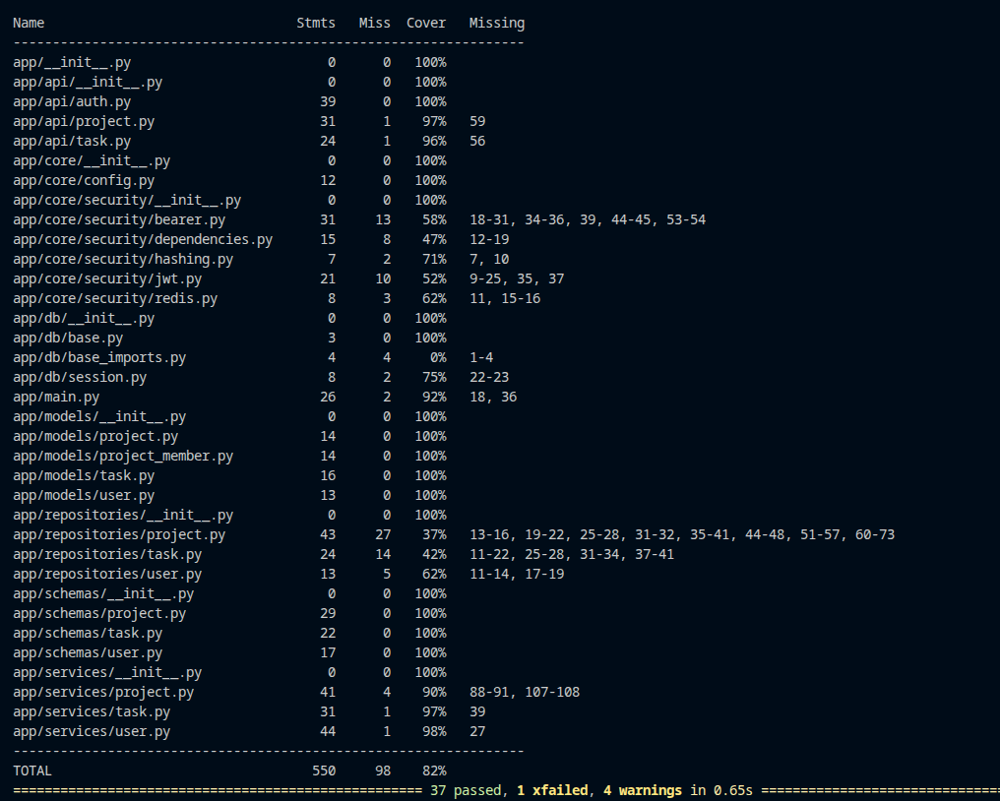

# Karyo Backend

FastAPI backend for Karyo.

This repo includes a deliberate regression-testing expansion: tests are organized by scope, coverage is tracked with `pytest-cov`, and risky branches are explicitly locked with regression cases.

## Screenshot


## Project Overview

The API covers auth, projects, and tasks. The test setup is built to catch behavior drift early, not just boost a percentage.

## Key Features

- Layered tests: `unit`, `integration`, `regression`
- Coverage-driven gap discovery via `pytest-cov`
- Shared fixtures and FastAPI dependency overrides
- Edge/failure path checks for auth and permissions
- GitHub Actions workflow for backend test runs

## Testing Philosophy

Three layers, three purposes:

- Unit: service logic in isolation (no HTTP)
- Integration: route behavior and API contracts
- Regression: bugs, edge cases, and failure branches we do not want to reintroduce

Coverage is used to find missing behavior checks. We prioritize branch and error-path coverage over trivial happy-path tests.

## Project Structure

```text
backend/
	app/
		api/
		services/
		repositories/
		models/
	tests/
		unit/
			test_user_service.py
			test_project_service.py
			test_task_service.py
		integration/
			test_auth_api.py
			test_project_api.py
			test_task_api.py
		regression/
			test_auth_and_permissions_regression.py
		conftest.py
```

Scope:

- `tests/unit/`: service/business logic with mocked dependencies
- `tests/integration/`: API contract checks through FastAPI routes
- `tests/regression/`: edge and bug-prone paths
- `tests/conftest.py`: shared fixtures and dependency overrides

## How To Run Tests

From the `backend/` directory:

```bash
# run all tests (coverage is enabled by default)
pytest

# run only regression tests
pytest tests/regression -q
```

Using `uv`:

```bash
uv run pytest
```

Coverage is automatically enabled through `pytest.ini`:

```toml
[pytest]
addopts = "--cov=app --cov-report=term-missing"
```

## Coverage Analysis

Coverage is measured against `app`.

Workflow:

1. Run `pytest`.
2. Identify modules with weak branch/error-path coverage.
3. Add tests for real behavior gaps.
4. Re-run coverage and confirm branch-critical paths are now protected.

PR check: if behavior changed, add or update a test.

## Writing New Tests (Contributor Guide)

Where to add tests:

- Add service logic tests to `tests/unit/`
- Add route contract tests to `tests/integration/`
- Add risk-based bug/edge tests to `tests/regression/`

Fixture usage:

- Reuse fixtures from `tests/conftest.py`
- Prefer dependency overrides over broad monkeypatching
- Keep fixtures focused and composable

Write a regression test when:

- A bug was fixed
- A branch had no prior coverage
- Input validation or auth/permission behavior changed
- A failure mode appears in testing or review

Naming:

- Use `test_<behavior>`, for example:
  - `test_update_task_status_returns_404_for_missing_task`
  - `test_login_rejects_invalid_credentials`

Rules of thumb:

- Keep tests deterministic and isolated
- Avoid duplicated setup
- Assert observable behavior only (status code, payload, state change)

## CI/CD Integration

Backend tests run in GitHub Actions on PRs and pushes for backend changes. This keeps regressions from slipping into main.

Typical CI step:

```bash
pytest --maxfail=1
```

## Future Improvements

- Increase branch coverage in repositories/security utilities
- Add lightweight performance checks for critical endpoints
- Add E2E API workflow tests
- Add `--cov-fail-under` threshold in CI

